# CloudDB Manager Database Schema (ERD)

Below is the Entity-Relationship Diagram for the CloudDB Manager system, designed with a dual-database architecture:

```plantuml
@startuml CloudDB Manager ERD

' Style settings
skinparam backgroundColor white
skinparam defaultFontName Arial
skinparam linetype ortho
skinparam packageStyle rectangle
skinparam shadowing false

' Entity styling
skinparam class {
  BackgroundColor #E2EFFF
  ArrowColor #303030
  BorderColor #3C7FC0
}

package "RDS-A: Management Database" {
  class Users {
    + user_id: INT (PK)
    --
    email: VARCHAR(255)
    password_hash: VARCHAR(255)
    first_name: VARCHAR(100)
    last_name: VARCHAR(100)
    status: ENUM('active','inactive','pending')
    created_at: TIMESTAMP
    updated_at: TIMESTAMP
    last_login: TIMESTAMP
    profile_image: VARCHAR(255)
    is_email_verified: BOOLEAN
    verification_token: VARCHAR(255)
    verification_expiry: TIMESTAMP
    password_reset_token: VARCHAR(255)
    password_reset_expiry: TIMESTAMP
    failed_login_attempts: INT
    locked_until: TIMESTAMP
  }
  
  class Tenants {
    + tenant_id: INT (PK)
    --
    tenant_name: VARCHAR(100)
    display_name: VARCHAR(200)
    status: ENUM('active','inactive','suspended')
    creation_date: TIMESTAMP
    billing_email: VARCHAR(255)
    subscription_plan: VARCHAR(50)
    subscription_status: VARCHAR(50)
    trial_expiry: TIMESTAMP
  }
  
  class UserTenantRoles {
    + id: INT (PK)
    --
    # user_id: INT (FK)
    # tenant_id: INT (FK)
    # role_id: INT (FK)
    is_primary: BOOLEAN
    assignment_date: TIMESTAMP
    assigned_by: INT
  }
  
  class Roles {
    + role_id: INT (PK)
    --
    role_name: VARCHAR(50)
    description: VARCHAR(255)
    permissions: TEXT
    is_system_role: BOOLEAN
  }
  
  class DatabaseInstances {
    + instance_id: INT (PK)
    --
    # tenant_id: INT (FK)
    # created_by: INT (FK)
    name: VARCHAR(64)
    display_name: VARCHAR(100)
    schema_name: VARCHAR(64)
    status: ENUM('running','stopped','deleted')
    created_at: TIMESTAMP
    updated_at: TIMESTAMP
    last_accessed: TIMESTAMP
    db_size: BIGINT
    is_template: BOOLEAN
    template_source: INT
    description: TEXT
    auto_stop: BOOLEAN
    auto_stop_minutes: INT
    deleted_at: TIMESTAMP
    purge_scheduled_at: TIMESTAMP
  }
  
  class Connections {
    + connection_id: INT (PK)
    --
    # instance_id: INT (FK)
    host: VARCHAR(255)
    port: INT
    username: VARCHAR(100)
    password_encrypted: VARCHAR(255)
    encryption_key_id: VARCHAR(100)
    max_connections: INT
    idle_timeout_seconds: INT
  }
  
  class QueryHistory {
    + query_id: INT (PK)
    --
    # user_id: INT (FK)
    # instance_id: INT (FK)
    query_text: TEXT
    execution_time_ms: INT
    row_count: INT
    status: ENUM('success','error','timeout')
    error_message: TEXT
    executed_at: TIMESTAMP
    ip_address: VARCHAR(45)
    is_favorite: BOOLEAN
    query_type: ENUM('select','dml','ddl','other')
    affected_rows: INT
  }
  
  class ResourceQuotas {
    + quota_id: INT (PK)
    --
    # tenant_id: INT (FK)
    # user_id: INT (FK)
    resource_type: VARCHAR(50)
    max_value: INT
    current_usage: INT
    update_timestamp: TIMESTAMP
    alert_threshold: INT
    alert_triggered: BOOLEAN
  }
  
  class AuditLogs {
    + log_id: INT (PK)
    --
    # user_id: INT (FK)
    # tenant_id: INT (FK)
    action: VARCHAR(100)
    entity_type: VARCHAR(50)
    entity_id: INT
    old_values: TEXT
    new_values: TEXT
    ip_address: VARCHAR(45)
    user_agent: VARCHAR(255)
    timestamp: TIMESTAMP
    status: VARCHAR(50)
  }
  
  class Invitations {
    + invitation_id: INT (PK)
    --
    # tenant_id: INT (FK)
    # invited_by: INT (FK)
    # role_id: INT (FK)
    email: VARCHAR(255)
    token: VARCHAR(255)
    status: ENUM('pending','accepted','expired')
    created_at: TIMESTAMP
    expires_at: TIMESTAMP
    accepted_at: TIMESTAMP
    message: TEXT
  }
  
  class UserPreferences {
    + preference_id: INT (PK)
    --
    # user_id: INT (FK)
    preference_key: VARCHAR(100)
    preference_value: TEXT
    updated_at: TIMESTAMP
  }
  
  class Metrics {
    + metric_id: INT (PK)
    --
    # tenant_id: INT (FK)
    # instance_id: INT (FK)
    # user_id: INT (FK)
    metric_name: VARCHAR(100)
    metric_value: DOUBLE
    timestamp: TIMESTAMP
    aggregation_period: VARCHAR(20)
  }
}

package "RDS-B: Sandbox Database" {
  note "Each tenant gets isolated database schemas" as N1

  class SystemTables {
    + tenant_prefix_table_name
    --
    Various tables to store actual
    user database content (dynamically
    created based on user actions)
  }
}

' Relationships
Users "1" -- "0..*" UserTenantRoles
Tenants "1" -- "0..*" UserTenantRoles
Roles "1" -- "0..*" UserTenantRoles
Users "1" -- "0..*" QueryHistory
Users "1" -- "0..*" AuditLogs
Users "1" -- "0..*" UserPreferences
Users "1" -- "0..*" Invitations : invited by
Tenants "1" -- "0..*" Invitations
Roles "1" -- "0..*" Invitations
Tenants "1" -- "0..*" DatabaseInstances
Users "1" -- "0..*" DatabaseInstances : created by
DatabaseInstances "1" -- "1" Connections
DatabaseInstances "1" -- "0..*" QueryHistory
Tenants "1" -- "0..*" AuditLogs
Tenants "1" -- "0..*" ResourceQuotas
Users "0..1" -- "0..*" ResourceQuotas
DatabaseInstances "0..1" -- "0..*" Metrics
Tenants "0..1" -- "0..*" Metrics
Users "0..1" -- "0..*" Metrics

@enduml
```

## Detailed Table Descriptions

### RDS-A: Management Database Tables

#### 1. Users
**Purpose**: Stores user account information and authentication details.
- **Primary Key**: `user_id` - Auto-incrementing unique identifier
- **Key Fields**:
  - `email` - Unique email address for login
  - `password_hash` - BCrypt-hashed password
  - `status` - User account state (active/inactive/pending)
  - `verification_token` - For email verification
  - `failed_login_attempts` - Security monitoring
- **Indexes**: 
  - Unique index on `email`
  - Index on `status`

#### 2. Tenants
**Purpose**: Represents organizations/accounts in the multi-tenant system.
- **Primary Key**: `tenant_id` - Auto-incrementing unique identifier
- **Key Fields**:
  - `tenant_name` - Unique internal name (slug format)
  - `subscription_plan` - Plan level determining quotas
  - `status` - Tenant state (active/inactive/suspended)
- **Indexes**: 
  - Unique index on `tenant_name`
  - Index on `status`

#### 3. UserTenantRoles (Junction Table)
**Purpose**: Maps users to tenants with specific roles (many-to-many).
- **Primary Key**: `id` - Auto-incrementing unique identifier
- **Foreign Keys**: 
  - `user_id` → Users
  - `tenant_id` → Tenants
  - `role_id` → Roles
- **Key Fields**:
  - `is_primary` - Identifies user's primary tenant
- **Constraints**:
  - Unique constraint on (user_id, tenant_id, role_id)

#### 4. Roles
**Purpose**: Defines permission sets assignable to users.
- **Primary Key**: `role_id` - Auto-incrementing unique identifier
- **Key Fields**:
  - `role_name` - Unique role identifier
  - `permissions` - JSON or serialized permission structure
  - `is_system_role` - Identifies built-in roles (cannot be modified)
- **Default Records**:
  - Viewer (read-only)
  - Developer (read-write)
  - Tenant Admin (user management)
  - Super Admin (system-wide access)

#### 5. DatabaseInstances
**Purpose**: Metadata about user-created database instances.
- **Primary Key**: `instance_id` - Auto-incrementing unique identifier
- **Foreign Keys**:
  - `tenant_id` → Tenants
  - `created_by` → Users
- **Key Fields**:
  - `name` - Database name (unique within tenant)
  - `schema_name` - Actual schema name in RDS-B
  - `status` - Instance state (running/stopped/deleted)
  - `db_size` - Current database size in bytes
  - `deleted_at` - Soft delete timestamp
- **Indexes**:
  - Compound index on (tenant_id, name)
  - Index on status

#### 6. Connections
**Purpose**: Stores connection details for database instances.
- **Primary Key**: `connection_id` - Auto-incrementing unique identifier
- **Foreign Key**: `instance_id` → DatabaseInstances
- **Key Fields**:
  - `host` - Database hostname
  - `username` - Connection username
  - `password_encrypted` - Encrypted connection password
  - `max_connections` - Connection limit for this instance

#### 7. QueryHistory
**Purpose**: Records executed queries for reference and analysis.
- **Primary Key**: `query_id` - Auto-incrementing unique identifier
- **Foreign Keys**:
  - `user_id` → Users
  - `instance_id` → DatabaseInstances
- **Key Fields**:
  - `query_text` - Actual SQL query
  - `execution_time_ms` - Performance metric
  - `status` - Query result status
  - `query_type` - Classification of query
- **Indexes**:
  - Compound index on (user_id, executed_at)
  - Compound index on (instance_id, executed_at)
  - Full text index on query_text (if supported)

#### 8. ResourceQuotas
**Purpose**: Manages resource allocation limits for tenants and users.
- **Primary Key**: `quota_id` - Auto-incrementing unique identifier
- **Foreign Keys**:
  - `tenant_id` → Tenants (optional)
  - `user_id` → Users (optional)
- **Key Fields**:
  - `resource_type` - Resource being limited (db_count, storage, etc.)
  - `max_value` - Maximum allowed value
  - `current_usage` - Current consumption level
- **Note**: Either tenant_id or user_id should be set, not both

#### 9. AuditLogs
**Purpose**: Security and operational audit trail.
- **Primary Key**: `log_id` - Auto-incrementing unique identifier
- **Foreign Keys**:
  - `user_id` → Users
  - `tenant_id` → Tenants
- **Key Fields**:
  - `action` - Activity being logged
  - `entity_type` - Type of object affected
  - `entity_id` - Identifier of affected object
  - `old_values`/`new_values` - JSON of changed data
- **Indexes**:
  - Compound index on (tenant_id, timestamp)
  - Compound index on (user_id, timestamp)
  - Index on entity_type, entity_id

#### 10. Invitations
**Purpose**: Manages pending user invitations to tenants.
- **Primary Key**: `invitation_id` - Auto-incrementing unique identifier
- **Foreign Keys**:
  - `tenant_id` → Tenants
  - `invited_by` → Users
  - `role_id` → Roles
- **Key Fields**:
  - `email` - Invitee's email address
  - `token` - Secure invitation token
  - `status` - Invitation state (pending/accepted/expired)
  - `expires_at` - Token expiration timestamp
- **Indexes**:
  - Index on token
  - Compound index on (email, tenant_id, status)

#### 11. UserPreferences
**Purpose**: Stores user-specific application settings.
- **Primary Key**: `preference_id` - Auto-incrementing unique identifier
- **Foreign Key**: `user_id` → Users
- **Key Fields**:
  - `preference_key` - Setting identifier
  - `preference_value` - Setting value
- **Indexes**:
  - Compound unique index on (user_id, preference_key)

#### 12. Metrics
**Purpose**: Stores performance and usage metrics for analysis.
- **Primary Key**: `metric_id` - Auto-incrementing unique identifier
- **Foreign Keys**:
  - `tenant_id` → Tenants (optional)
  - `instance_id` → DatabaseInstances (optional)
  - `user_id` → Users (optional)
- **Key Fields**:
  - `metric_name` - Type of metric
  - `metric_value` - Numeric value
  - `timestamp` - When recorded
  - `aggregation_period` - Time bucket (minute, hour, day)
- **Indexes**:
  - Compound index on (metric_name, timestamp)
  - Compound index on (tenant_id, metric_name, timestamp)

### RDS-B: Sandbox Database

This database hosts the actual tenant database instances, with each tenant allocated its own isolated schema(s). The schemas are dynamically created based on user actions and contain standard MySQL objects:

- Tables
- Views
- Stored Procedures
- Functions
- Triggers
- Events

Each schema follows a naming convention that includes the tenant identifier to ensure isolation and prevent naming conflicts.

## Key Database Design Features

1. **Soft Delete Implementation**:
   - The `deleted_at` field in key tables enables data recovery within retention periods
   - Purge operations occur through scheduled background jobs

2. **Security Design**:
   - Passwords stored as BCrypt hashes
   - Database credentials encrypted at rest
   - Comprehensive audit logging for security events

3. **Multi-tenancy Isolation**:
   - Tenant context enforced at the database level
   - Schema-per-tenant model in RDS-B
   - Resource quotas managed at both tenant and user levels

4. **Performance Considerations**:
   - Appropriate indexes on frequently queried fields
   - Timestamp fields for analyzing usage patterns
   - Metric tracking for identifying optimization opportunities

5. **Data Integrity**:
   - Foreign key constraints enforce referential integrity
   - Status fields use ENUM types for data validation
   - Transaction support for critical operations

This database schema provides a solid foundation for the CloudDB Manager MVP while establishing a structure that can scale to support additional features in future phases.