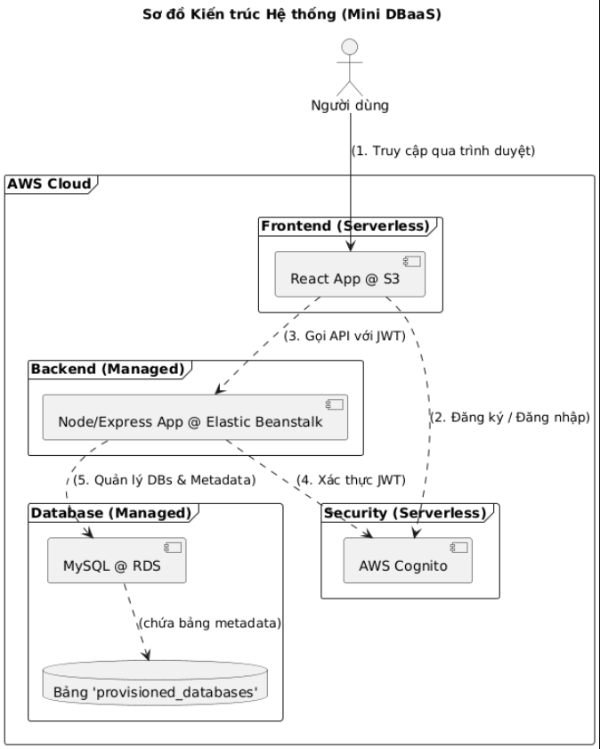

# Dự án: Mini DBaaS Portal (Đề tài 8)

## 1. Giới thiệu & Tầm nhìn

**Tên dự án:** Mini DBaaS (Database as a Service) Portal

**Mục tiêu:** Xây dựng một cổng thông tin (web portal) đáp ứng yêu cầu của Đề tài 8: "Xây dựng hệ thống cơ sở dữ liệu trên nền tảng cloud computing"

### Giải thích cốt lõi (Quan trọng):

- **KHÔNG LÀM GÌ:** Dự án này KHÔNG xây dựng một phần mềm SQL Client (như DBeaver hay phpMyAdmin)
- **LÀM GÌ:** Dự án này xây dựng một DỊCH VỤ (một "Quầy Lễ tân Tự động")
- **Dịch vụ:** Tự động Cấp phát (provisioning) và Thu hồi (de-provisioning) CSDL MySQL theo yêu cầu của người dùng
- **Sản phẩm:** "Chìa khóa" (credentials: Host, Port, User, Pass)
- **Yêu cầu "sử dụng như phần mềm":** Được đáp ứng khi người dùng lấy "chìa khóa" này và nhập vào các phần mềm CÓ SẴN (như DBeaver) để sử dụng

## 2. Kiến trúc Hệ thống

Chúng ta sử dụng kiến trúc "Serverless-First" và "Managed" trên AWS để tối ưu hóa tài khoản AWS for Student.

```plantuml
@startuml
!theme simple

title Sơ đồ Kiến trúc Hệ thống (Mini DBaaS)

actor "Người dùng" as User

frame "AWS Cloud" {

    frame "Frontend (Serverless)" {
        [React App @ S3] as S3
    }

    frame "Backend (Managed)" {
        [Node/Express App @ Elastic Beanstalk] as EB
    }

    frame "Database (Managed)" {
        [MySQL @ RDS] as RDS
        database "Bảng 'provisioned_databases'" as MetaDB
        RDS ..> MetaDB : (chứa bảng metadata)
    }

    frame "Security (Serverless)" {
        [AWS Cognito] as Cognito
    }

}

' --- Mối quan hệ --- '
User --> S3 : (1. Truy cập qua trình duyệt)
S3 ..> Cognito : (2. Đăng ký / Đăng nhập)
S3 ..> EB : (3. Gọi API với JWT)
EB ..> Cognito : (4. Xác thực JWT)
EB ..> RDS : (5. Quản lý DBs & Metadata)

@enduml
```



## 3. Công nghệ (Tech Stack)

### Frontend (FE):

- **Ngôn ngữ:** React (TypeScript)
- **Build tool:** Vite
- **Routing:** react-router-dom
- **Gọi API:** axios
- **Xác thực:** aws-amplify (để giao tiếp với Cognito)

### Backend (BE):

- **Nền tảng:** Node.js (TypeScript)
- **Framework:** Express.js
- **Driver CSDL:** mysql2 (bản promise-based)
- **Khác:** cors, dotenv, aws-jwt-verify (hoặc jwk-to-pem + jsonwebtoken)

### Hạ tầng (AWS Services):

- **AWS Cognito:** Dịch vụ xác thực (Đăng ký/Đăng nhập)
- **AWS RDS (MySQL):** Dịch vụ CSDL được quản lý (Chọn Free Tier)
- **AWS S3:** Dịch vụ lưu trữ file tĩnh (Host Frontend)
- **AWS Elastic Beanstalk:** Dịch vụ PaaS (Host Backend Node.js) (Chọn Free Tier)

## 4. Mô hình Dữ liệu (Bảng Quản lý)

Chúng ta cần 1 bảng trong RDS (có thể đặt tên là `app_manager` hoặc dùng chung instance) để quản lý các CSDL đã cấp phát.

### Bảng: `provisioned_databases`

| Tên cột | Kiểu dữ liệu | Chú thích |
|---------|--------------|-----------|
| id | INT | Primary Key, Auto Increment |
| owner_id | VARCHAR(255) | **Quan trọng:** sub ID từ token Cognito của người dùng |
| db_name | VARCHAR(100) | Tên database đã tạo (ví dụ: `user_db_1a2b3c`) |
| db_user | VARCHAR(100) | Tên user SQL đã tạo (ví dụ: `user_1a2b3c`) |
| created_at | TIMESTAMP | DEFAULT CURRENT_TIMESTAMP |

## 5. Đặc tả API Endpoints (Backend Node/Express)

**Prefix:** `/api`

**Middleware:** Mọi route (trừ `/health`) đều phải được bảo vệ bằng `authMiddleware` (kiểm tra JWT)

| Method | Endpoint | Bảo vệ | Mô tả |
|--------|----------|--------|-------|
| GET | `/health` | Không | Kiểm tra server còn sống |
| GET | `/me` | Có | Lấy thông tin user hiện tại (từ token) |
| POST | `/databases/create` | Có | **(Core)** Yêu cầu tạo DB mới. Chạy CREATE DB/USER, lưu vào bảng `provisioned_databases` |
| GET | `/databases` | Có | Lấy danh sách DBs (`db_name`, `created_at`) của user hiện tại (dựa trên `owner_id`) |
| DELETE | `/databases/:db_name` | Có | **(Core)** Xóa một DB. Phải kiểm tra `owner_id` trước khi chạy DROP DB/USER |

## 6. Kế hoạch Thực thi (Chi tiết 3 Sprints)

### SPRINT 1: Nền tảng & Xác thực

**Mục tiêu:** Người dùng có thể Đăng ký, Xác thực tài khoản, và Đăng nhập. Frontend đã có thể gọi 1 API được bảo vệ của Backend.

#### Tác vụ AWS (Setup):

1. Tạo Cognito User Pool (lấy UserPoolId, ClientId)
2. Tạo RDS (MySQL) Free Tier (lấy Host, Master User, Master Pass)

#### Tác vụ Backend (Node.js):

1. Cài đặt Express, TS, mysql2
2. Cấu hình cors, dotenv (lưu pass RDS)
3. Viết `authMiddleware` để xác thực JWT token từ Cognito
4. Tạo route `GET /api/health` (public)
5. Tạo route `GET /api/me` (protected) để test

#### Tác vụ Frontend (React):

1. Cài đặt Vite, axios, react-router-dom, aws-amplify
2. Cấu hình Amplify SDK với thông tin Cognito
3. Tạo các trang (Component): `/login`, `/register`, `/confirm-account`
4. Tạo trang `/dashboard` (bị khóa bởi "Protected Route")
5. Logic: Người dùng đăng nhập → amplify lưu token → Vào Dashboard → Gọi API `/api/me` thành công

### SPRINT 2: Tính năng Lõi - Cấp phát Database

**Mục tiêu:** Người dùng đã đăng nhập có thể bấm nút "Tạo Database" và nhận được credentials.

#### Tác vụ Backend (Node.js):

1. Kết nối vào RDS (với Master User) để tạo bảng `provisioned_databases`
2. Viết logic cho route `POST /api/databases/create`:
   - Lấy `owner_id` (sub) từ `req.user`
   - Tạo tên DB, User, Pass ngẫu nhiên
   - Chạy SQL Admin: `CREATE DATABASE ...`, `CREATE USER ...`, `GRANT PRIVILEGES ...`
   - Lưu (`owner_id`, `db_name`, `db_user`) vào bảng `provisioned_databases`
   - Trả về (`Host`, `Port`, `db_name`, `db_user`, `password_ngẫu_nhiên`) cho Frontend

#### Tác vụ Frontend (React):

1. Trên trang `/dashboard`, tạo nút "Tạo Database Mới"
2. Tạo `isLoading` state
3. Viết hàm gọi `POST /api/databases/create` (gửi kèm token)
4. Tạo Modal (hộp thoại) để hiển thị credentials trả về (Host, Port, User, Pass)
5. Thêm cảnh báo: "Hãy lưu lại mật khẩu này, chúng tôi không hiển thị nó lần nữa"
6. **Kiểm thử:** Dùng DBeaver/Workbench kết nối thử bằng credentials vừa được cấp

### SPRINT 3: Hoàn thiện, Quản lý & Deploy

**Mục tiêu:** Người dùng có thể xem danh sách và xóa DB của họ. Toàn bộ ứng dụng được deploy lên AWS.

#### Tác vụ Backend (Node.js):

1. Viết logic `GET /api/databases`: Lấy `owner_id` từ `req.user`, SELECT từ bảng `provisioned_databases`
2. Viết logic `DELETE /api/databases/:db_name`:
   - Lấy `owner_id` và `db_name`
   - Kiểm tra bảo mật: `SELECT db_user FROM provisioned_databases WHERE owner_id = ? AND db_name = ?`
   - Nếu khớp → Chạy `DROP DATABASE ...`, `DROP USER ...`
   - Xóa record khỏi bảng `provisioned_databases`

#### Tác vụ Frontend (React):

1. Gọi `GET /api/databases` khi vào Dashboard và hiển thị danh sách (dùng `.map()`)
2. Thêm nút "Xóa" cho mỗi item
3. Khi bấm "Xóa", hiển thị Modal xác nhận: "Bạn có chắc muốn xóa ...?"
4. Nếu xác nhận, gọi `DELETE /api/databases/:db_name` và cập nhật lại danh sách

#### Tác vụ Deployment (AWS):

1. **Frontend:**
   - Chạy `npm run build` → Upload thư mục `dist` lên S3 Bucket → Kích hoạt "Static website hosting"
2. **Backend:**
   - Build (TS → JS) → Nén (zip) code → Deploy lên Elastic Beanstalk
3. **Cấu hình:**
   - Cập nhật biến môi trường (Environment Variables) trên Elastic Beanstalk (cho pass RDS...)
   - Cập nhật CORS trên Backend để chấp nhận domain S3
