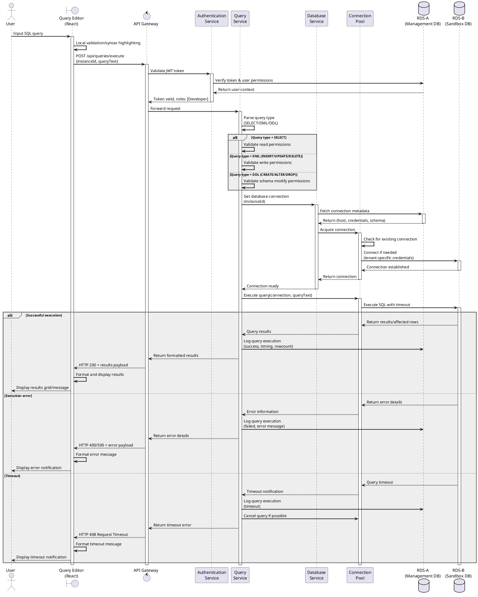

# CloudDB Manager - Core Query Execution Sequence Diagram

Here's a detailed sequence diagram illustrating the core query execution flow, which represents the central functionality of the CloudDB Manager system:

## Detailed Sequence Description

This sequence diagram illustrates the complete flow of executing an SQL query in the CloudDB Manager system, which is the core functionality of the platform. Here's a detailed explanation of each phase:

### 1. Query Initiation

- **User Input**: The process begins with the user entering an SQL query in the Query Editor interface.
- **Client-Side Validation**: The React-based frontend performs immediate syntax highlighting and basic validation to provide instant feedback.
- **API Request**: The query is submitted to the backend via a POST request to `/api/queries/execute`, including both the query text and the target database instance ID.

### 2. Authentication and Authorization

- **Token Validation**: The API Gateway intercepts the request and forwards it to the Authentication Service.
- **Permission Verification**: The Authentication Service validates the JWT token against the Management Database (RDS-A) and retrieves the user's role and permission context.
- **Context Establishment**: The user's context (including tenant context and role) is attached to the request.

### 3. Query Analysis and Permission Check

- **Query Parsing**: The Query Service analyzes the submitted SQL to determine its type:
  - SELECT/SHOW (read-only queries)
  - DML (INSERT/UPDATE/DELETE) for data modification
  - DDL (CREATE/ALTER/DROP) for schema changes
- **Permission Validation**: Based on query type, different permission checks are applied:
  - READ operations: Available to all roles
  - WRITE operations: Require Developer or higher role
  - SCHEMA modifications: Require Developer or higher role with potential restrictions

### 4. Connection Management

- **Metadata Retrieval**: The Database Service fetches connection details from the Management Database (RDS-A).
- **Connection Acquisition**: The Connection Pool manages database connections efficiently:
  - Reuses existing connections when possible
  - Creates new connections as needed
  - Applies tenant-specific credentials
  - Enforces connection limits
- **Connection Security**: Tenant isolation is maintained through separate credentials and schemas.

### 5. Query Execution

- **Execution Context**: The query is executed within the tenant's sandbox environment in RDS-B.
- **Resource Controls**: Execution includes:
  - Query timeout limits
  - Result size limits
  - Transaction boundaries if applicable
- **Isolation Enforcement**: Queries only execute within the tenant's designated schema.

### 6. Result Processing and Response Handling

The sequence has three possible outcomes:

#### Successful Execution
- Results are retrieved from the database
- Query metrics (execution time, row count) are recorded in the Management Database
- Formatted results are returned through the API Gateway
- The Query Editor displays results in a user-friendly grid or message format

#### Error Handling
- Database errors are captured and translated to meaningful user messages
- Error details are logged for troubleshooting
- Appropriate HTTP status codes are returned
- The Query Editor displays a formatted error notification

#### Timeout Management
- Long-running queries are interrupted at the timeout threshold
- The system attempts to cancel the query at the database level
- Timeout events are logged for optimization purposes
- The user receives a specific timeout notification

### 7. Key Security and Performance Aspects

Throughout this sequence:

- **Multi-layered Security**: Authentication → Authorization → Data access controls
- **Tenant Isolation**: Separate schemas and credentials prevent cross-tenant data access
- **Performance Monitoring**: Query metrics are captured for analysis
- **Resource Protection**: Timeouts and limits prevent resource exhaustion
- **Connection Efficiency**: Connection pooling optimizes database resource usage

This sequence represents the most critical workflow in the CloudDB Manager system and demonstrates how the dual-database architecture provides both security isolation and operational efficiency.